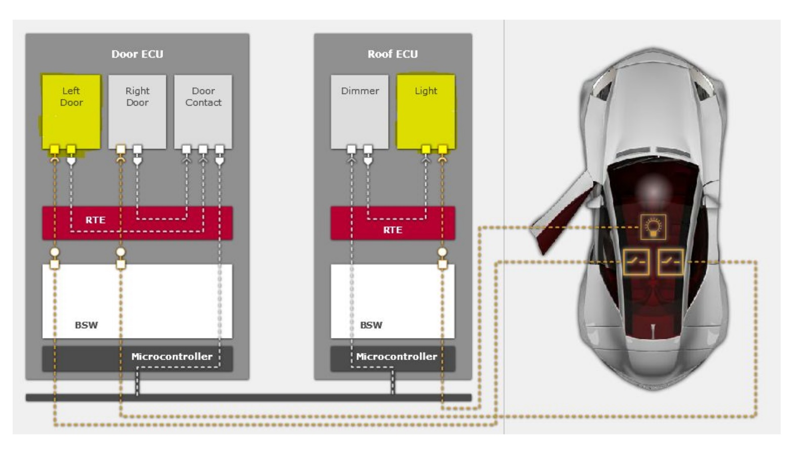
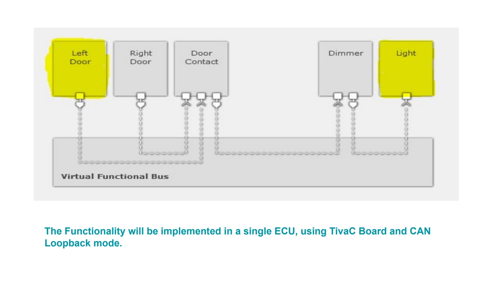

# CAR Door/Roof Light Control System

## Table of Contents
- [Project Description](#project-description)
- [Project Target](#project-target)
- [Requirements](#requirements)
- [Project Tasks](#project-tasks)

## Project Description

This is AutoSAR Graduation Project for the AutoSAR diploma from [AMIT-Learning](https://amit-learning.com).\
This is a project for controlling the Car Door and Roof Light using AutoSAR architecture. The project is implemented using TivaC microcontroller and FreeRTOS. The project is divided into two main parts:
- **BSW**: Basic Software Layer, which contains the Com Stack and the RTE.
- **Application**: Which contains the application SWC (Software Component) and the OS.

## Project Target

The project has been simulated on `TivaC TM4C123GH6PM` using the onboard SW1 and RGB Led.

## Requirements
- The Car Door should be simulated using TivaC SW1.
- The Roof Light should be simulated using TivaC RGB Led.
- The default Door state is CLOSED.
- The default Roof Light is OFF.
- If the Car Door is OPENED(single SW1 press) the Roof Light should be ON.
- If the Car Door is CLOSED(single SW1 press) the Roof Light should be OFF.
- The default Roof Light color is RED.
- If the Door is OPENED or CLOSED for more than 3 Seconds, the Roof Light should be toggled with different color (🟢GREEN -> 🔵 BLUE ->🔴 RED ).

## Project Tasks
- CAN:
    - T1.A Creating Rx mailbox.
    - T1.B Creating Tx mailbox.
    - T1.C Implementing the function Can_Write to send Tx message.
    - T1.D Handling Received Rx message inside Can interrupt.
- Com Rx processing:
    - T2.A Handling Rx signal reception.
    - T2.B Update signal buffer with data from PDU.
    - T2.C Implement Com_RecieveSignal Function that is called from application.
- Com Tx processing:
    - T3.A Handling of Com_MainfunctionTx()
    - T3.B Implement Com_SendSignal function that is called from application.
- Design Door_SWC:
    - T4.A Design Door_SWC with all needed PORTS and Runnables.
- Design Light_SWC:
    - T5.A Design Light_SWC with all needed PORTS and Runnables.
- RTE implementation:
    - T6.A Implement the RTE PORTs
- RTE OS implementation:
    - T7.A Implement the needed tasks for application and BSW layers.
- `main.c`:
    - T8.A TivaC Dio Initialization.
    - T8.B Initialize Com Stack modules.
    - T8.C Initialize FreeRTOS and create needed tasks.
- **[BONUS]** Implement new feature:
    - If DOOR is opened for more than 5 seconds the Roof Light should be toggled  every 500ms.
    - Two messages should be added one for TX and the other For RX.
    - Add the needed Com Stack configurations across all of the stack (Can mailboxes, Com signals and PDUs)
    - You should implemented the RX PDU processing to be IMMEDIATE.
    - You should implement RX Signal notification function that will be called when signal received.
    - Assume any missing information in the first requirements(e.g. When the Roof light will stop toggling).